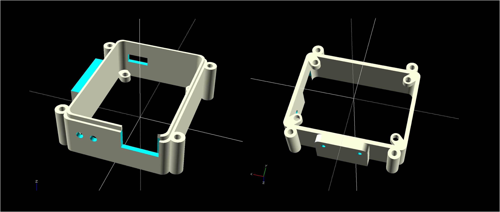
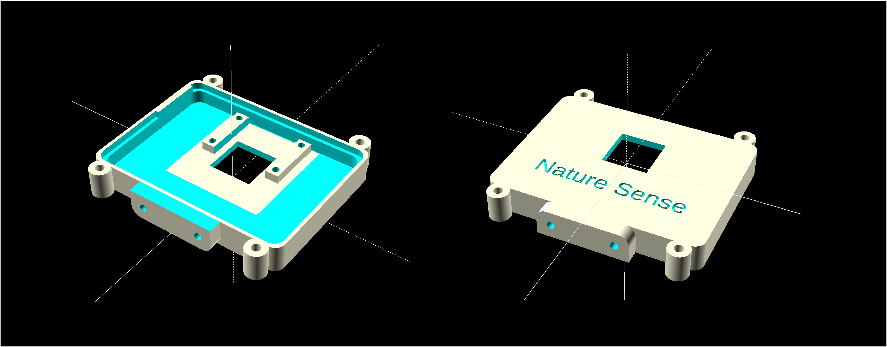
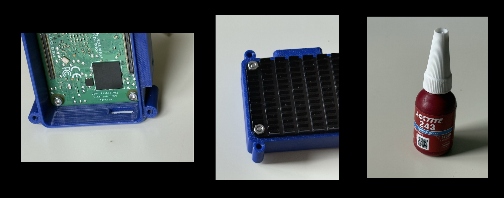

# The AI Camera

## Introduction

The AI camera comprises the following components:

| Component                                                    | Quantity | Rererence                                                    |
| ------------------------------------------------------------ | -------- | ------------------------------------------------------------ |
| Raspberry Pi CM5, 2MB, 16GB eMMC, WiFi                       | 1        | https://thepihut.com/products/raspberry-pi-compute-module-5?variant=53746054562177 |
| Waveshare, Nano Base Board (A) for Raspberry Pi Compute Module 5 | 1        | https://www.waveshare.com/cm5-nano-a.htm                     |
| Raspberry Pi Compute Module 5 Passive Cooler                 | 1        | https://thepihut.com/products/raspberry-pi-compute-module-5-passive-cooler |
| Raspberry Pi Camera Module 3                                 | 1        | https://thepihut.com/products/raspberry-pi-camera-module-3   |
| Raspberry Pi Zero "Stub" Camera Cable - 38mm                 | 1        | https://thepihut.com/products/raspberry-pi-zero-stub-camera-cable-38mm |
| M2.5 x 25 hex bolts                                          | 4        |                                                              |
| M2.5 nuts                                                    | 4        |                                                              |
| M2.5 x 7 hex bolts                                           | 4        |                                                              |
| M2 x 4                                                       | 4        |                                                              |
| 3d printed case                                              |          |                                                              |

## Architecture 

There aee only 3 components in the AI camera:

1. A Raspberry Pi Compute Module 5
2. A Waveshare Bsse Board Nano (A) for Compute Module 5
3. A Raspberry Pi Camera 3 module

As shown in the following diagram:

The Compute Module 5 is not a computer as it provides no I/O except for WiFi. The board used in the AI camera has 2M of RAM, 16GB of eMMC and WiFi/Bluetooth.

The I/O capabilities are provided by a Waveshare  Bsse Board Nano (A) for Compute Module 5, which connects directly to the CM5 and provides  1 USB-A (usb 3.2), 1 - USB-C for powrer and flashing, an SD card (which is not used), and 2 MIPI connections for displays or cameras.

The 3rd component is the Pi Camera 3 module. This is a 12MP 4k camera with autofocus. I connects to the MIPI1 socket on the Baseboard.

## 3d Printed Case

The AI Camer is constrcted using a 2-part 3d printed case.

### Back

The back of the case mounts the

- Heatsink
- The CM5
- The baseboard

### Front

The Pi Camera 3 module is mounted to the case front with the lens pointing through the provided hole.

## Assembly

The case backhas 4 lugs on the inside to mount the CM5 and the heatsink together. The CM5 is on the inside of the case and the heatsink on the outside. Stick the provided thermal strip  to the CPU and WiFi module on the CM5 before final assembly. 

Use the  4 M2.5x7 bolts and nuts. Push the bolts through from the inside and attach the nuts on the outside. It is recommented to use a small amount of Loctite on each nut to avoid them working loose later.

The next step is to attach the camera to the baseboard. This is quite an intricate operation and care must be taken to ensure that:

- The cable is installed the right way round - with the copper on the same side as the pins in the sockets (on the camera the copper should face towards the lens, and on the baseboard it should face towards the centre).
- Both ends of the cable are firmly inserted into the sockets. If they are misaligned at all the camera won't work.

1. With the baseboard outside the case connect the cable between it and the camera. On the baseboard it should be connected to MIPI1 - which is the socket nearest the centre of the board.
2. Bolt the camera to the case front using the 4 M2 x 4 bolts.
3. Finally push the Baseboard onto the connectors on the back of the Raspberry until it clicks in place.

Finally bolt the front and back of the case together

It is recommended not to add all the bolts until ther software has been loaded and the camera tested.

## Mount

