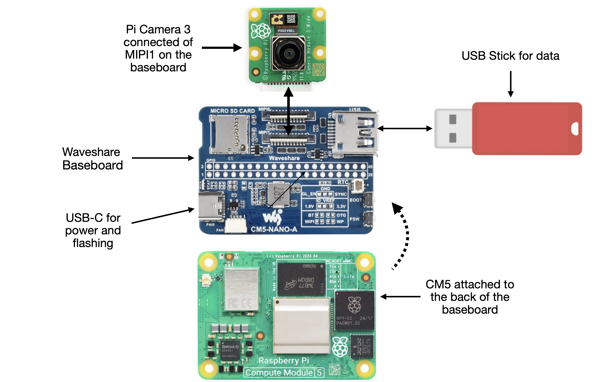

## Architecture 

There aee only 3 components in the AI camera:

1. A Raspberry Pi Compute Module 5
2. A Waveshare Bsse Board Nano (A) for Compute Module 5
3. A Raspberry Pi Camera 3 module

As shown in the following diagram:

The Compute Module 5 is not a computer as it provides no I/O except for WiFi. The board used in the AI camera has 2M of RAM, 16GB of eMMC and WiFi/Bluetooth.

The I/O capabilities are provided by a Waveshare  Bsse Board Nano (A) for Compute Module 5, which connects directly to the CM5 and provides  1 USB-A (usb 3.2), 1 - USB-C for powrer and flashing, an SD card (which is not used), and 2 MIPI connections for displays or cameras.

The 3rd component is the Pi Camera 3 module. This is a 12MP 4k camera with autofocus. I connects to the MIPI1 socket on the Baseboard.