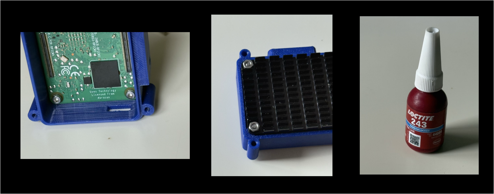
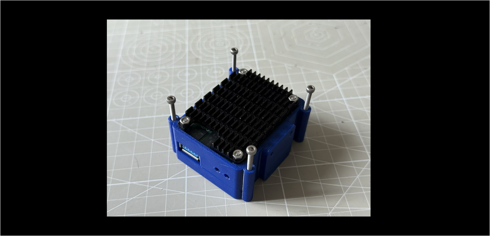

# Assembly

The case backhas 4 lugs on the inside to mount the CM5 and the heatsink together. The CM5 is on the inside of the case and the heatsink on the outside. Stick the provided thermal strip  to the CPU and WiFi module on the CM5 before final assembly. 

Use the  4 M2.5x7 bolts and nuts. Push the bolts through from the inside and attach the nuts on the outside. It is recommented to use a small amount of Loctite on each nut to avoid them working loose later.

The next step is to attach the camera to the baseboard. This is quite an intricate operation and care must be taken to ensure that:

- The cable is installed the right way round - with the copper on the same side as the pins in the sockets (on the camera the copper should face towards the lens, and on the baseboard it should face towards the centre).
- Both ends of the cable are firmly inserted into the sockets. If they are misaligned at all the camera won't work.

1. With the baseboard outside the case connect the cable between it and the camera. On the baseboard it should be connected to MIPI1 - which is the socket nearest the centre of the board.
2. Bolt the camera to the case front using the 4 M2 x 4 bolts.
3. Finally push the Baseboard onto the connectors on the back of the Raspberry until it clicks in place.

Finally bolt the front and back of the case together

> [!TIP]
>
> It is recommended not to add all the bolts until ther software has been loaded and the camera tested, in case it needs to be reopened.

