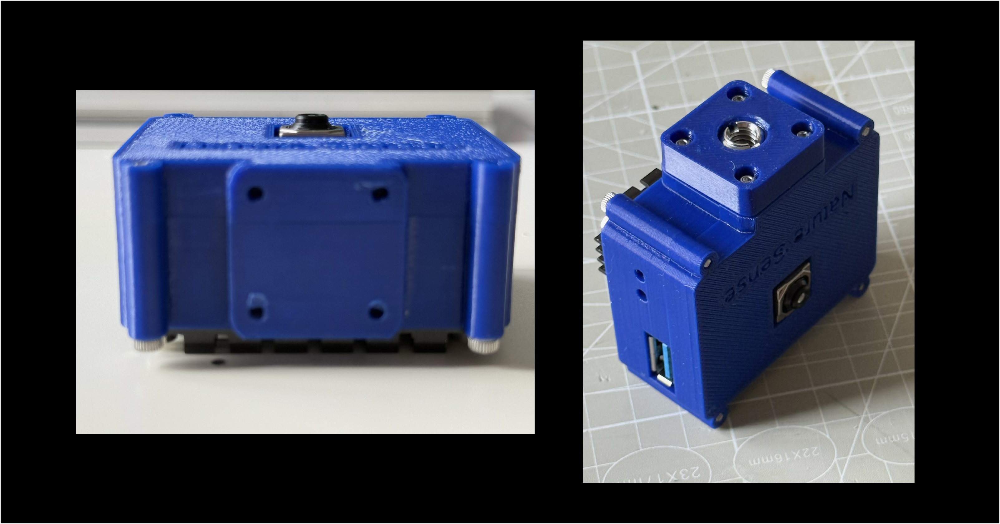
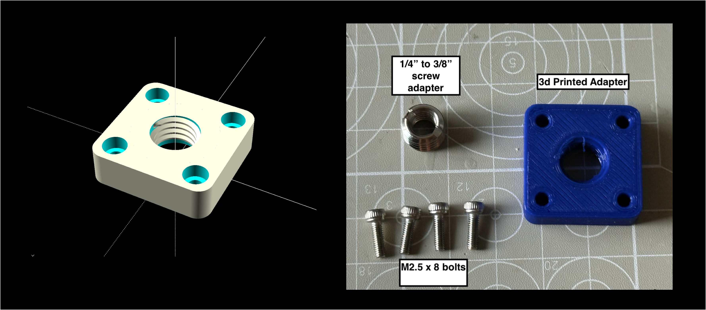

# Tripod Mount

There are 4 - 2.5mm bolt holes on the base of camera case arranged in a square with 17.5mm sides. The design includes an adapter for a tripod mount that uses these bolt holes. Other adapters could be designed if required.

The adadper is 3d-printed and requires 4 M2.5x8 bolts and a 1/4" to 3/8" screw adapter for the tripod to screw into.

