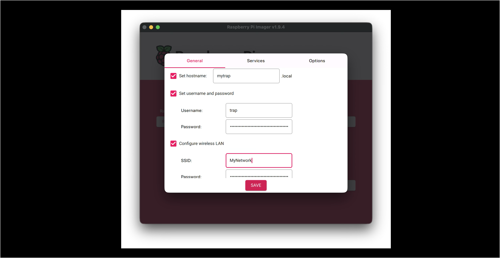

---


title: Installing the System
parent: Software Installation
nav_order: 2

---

# Installing the System

Raspberry Pi OS is installed on the Compute Module's internal eMMC. The eMMC can be made to act like a memory stick. this is done in 2 steps:

## Flash Mode

The board must be put into Flash Mode.  There is a button next to the USB-A socket to do this.


- Plug a USB-C cable into the module but leave the other end disconnected. Using a small screw-driver or similar and press and hold the flash-mode button.
- With the button still pressed plug the other end of the USB-C cable into your computer.
- Release the button. 

The Compute Module is now in "flash mode"


## rpiboot

The next step is to run a utility program - `rpiboot` which configures the eMMC to look like a memory stick.

Unfortunately, on the Mac there is no installable version of this tool, and it must be built locally.  For other platforms see  [here](https://github.com/raspberrypi/usbboot).

It must be built from the command line (Terminal) and the steps are as follows:

Instrall `brew` if you don't have it already.

```shell
/bin/bash -c "$(curl -fsSL https://raw.githubusercontent.com/Homebrew/install/HEAD/install.sh)"
```

Then clone the GitHub repository and build `rpiboot`

```shell
git clone --recurse-submodules --shallow-submodules --depth=1 https://github.com/raspberrypi/usbboot
cd usbboot
brew install libusb
brew install pkg-config
sudo make INSTALL_PREFIX=/usr/local install
```


When the Compute Module is in flash mode run rpiboot as follows:

```
sudo rpiboot
```

This is an example of the console output when it runs.

```shell
(base) steve@elnor ~ % sudo rpiboot
Password:
RPIBOOT: build-date 2025/07/16 pkg-version local e896b5b8

Please fit the EMMC_DISABLE / nRPIBOOT jumper before connecting the power and USB cables to the target device.
If the device fails to connect then please see https://rpltd.co/rpiboot for debugging tips.

Waiting for BCM2835/6/7/2711/2712...

Directory not specified - trying default /usr/local/share/rpiboot/mass-storage-gadget64/
Sending bootcode.bin
Successful read 4 bytes
Waiting for BCM2835/6/7/2711/2712...

Second stage boot server
File read: mcb.bin
File read: memsys00.bin
File read: memsys01.bin
File read: memsys02.bin
File read: memsys03.bin
File read: bootmain
Loading: /usr/local/share/rpiboot/mass-storage-gadget64//config.txt
File read: config.txt
Loading: /usr/local/share/rpiboot/mass-storage-gadget64//boot.img
File read: boot.img
Second stage boot server done
(base) steve@elnor ~ %
```

**DO NOT UNPLUG THE CAMERA AT THIS POINT.**

## Raspberry Pi Imager

The OS can now be installed using the standard Raspberry Pi Imager software.


- Set the 'Raspberry Pi Device' to 'Raspberry Pi 5'.
- Set the 'Operating System' to 'Raspberry Pi OS Lite (64bit)'
- Set the storage to be the 16GB eMMC from the CM5 - the only entry in the storage list.

The Settings should be configured as follows:



- Hostname - of your choice. The trap will be accessible on wifi with this name, and the same name is used to identify it on bluetooth.
- Username - "trap"
- Password - of your choice.
- Wireless LAN - SSID and Password - to match your local network.

Save these then continue to write the OS onto thr eMMC.

When complete unplug and replug the USB-C cable to reset the trap.
