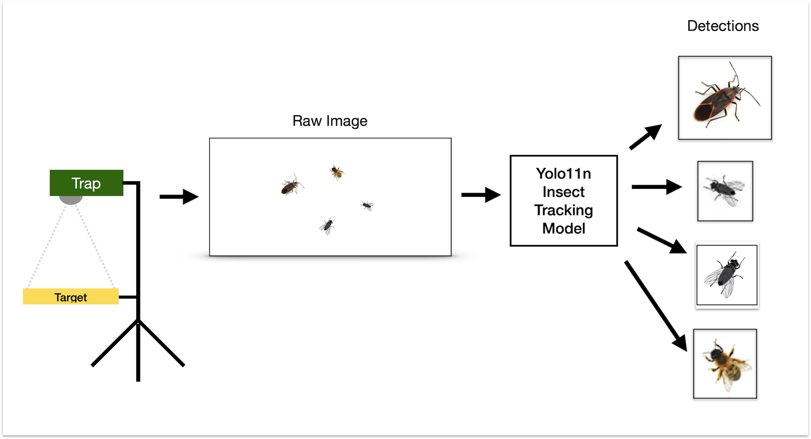

# Insect Classification

The AI Camera Trap is part of a two stage workflow to observe a target location and classify insects obseved  on the target during some observation period.

The classification workflow has two parts:

The **AI insect trap** - which uses a camera to view a target area, and a Yolo11n detection/tracking model to identify insects (note not classify) and provide a a high-resolution image with corresponding metadata for each unique insect detected.

An **offline classification workflow** that takes the images and metadata produced by the trap and runs it through Yolo11 classification model which augments the metadata with the classification class and score.

