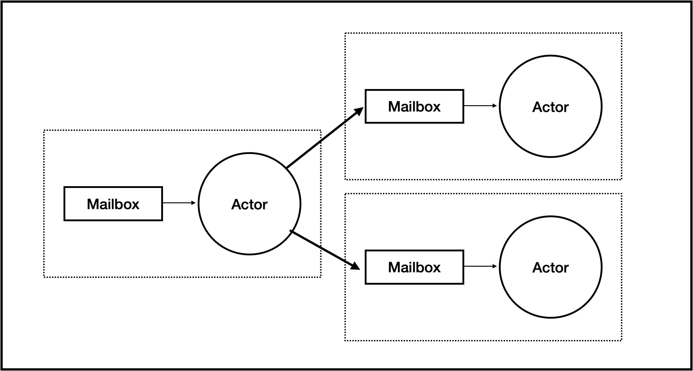

```

```

# Actor Framework

## Introduction

The AI Insect Trap is based around the **Naturesense Actor Framework** which is a simple C++ implementation of the  [**Actor Pattern** ](https://en.wikipedia.org/wiki/Actor_model) using [Boost ASIO](https://www.boost.org/doc/libs/latest/doc/html/boost_asio.html)  and [C++ (20) coroutines](https://en.cppreference.com/w/cpp/language/coroutines.html).

The Actor Pattern is a software architecture pattern that defines a set of independent software components called **Actors** which communicate with each other by passing messages using **Mailboxes**. 

Each Actor has a single input mailbox through which other actors can pass it messages. The messages can have different types, and the actor will  process them strictly one at a time. This means the actor is atomic, and has no need for any synchronisation.

Each Actor is also responsible for its own state. There is no shared state between Actors in an Actor System, again removing the need for any kind of synchronisation.



The Naturesense Actor Framework brings the following advantages to the trap software:

- **Modularity**. An ai-trap consists of multiple processing stages, where processing stage can be implemented as an actor. Alternative trap designs can be implemented using different actor-based processing stages, or different implementations of a stage can easily be usubtituted.
- **Asynchronicity**. An actor system is inherently asynchronous since all processing is triggered by the arrival of messages. An AI trap is essentially a (video)stream-based system.
- **Parallelism**. The asynchronism in an actor system provides for easy parallelism, in this case using threads and c++ coroutines

## Framework Concept

The Actor Frsmework is based arount two modern C++ tecnologies:

### Coroutines 

> Coroutines are a general control structure whereby flow control is cooperatively passed between two different routines without returning.

All asynchronous actor processing will be implemented using co-routines.  Co-routines provide collaborative multi-tasking.  Should preemptive multi-tasking be required (e,g to take advantage of multi-cores) co-routines can be run in threads.

### ASIO Concurrent Channels

> A concurrent channel may be used to send messages between different parts of the same application. A *message* is defined as a collection of arguments to be passed to a completion handler, and the set of messages supported by a channel is specified by its template parameters. Messages may be sent and received using asynchronous or non-blocking synchronous operations.

All mailboxes will be implemented using Asio Concurrent channels. They are thread-safe, they support multiple message types, and they can be used asynchronously with co-routines.


## Mailboxes

### Introduction

In the Actor Pattern  mailboxes are used to pass messages between actors. Each actor has a single input mailbox and its primary function is to listen to this mailbox and process messages sequentially as they arrive.  The actor processing  can create messages that are passed to other actors via their mailboxes.

In the Actor Framework, mailboxes are implemented using  [Boost Asio Concurrent Channels](https://www.boost.org/doc/libs/latest/doc/html/boost_asio/reference/experimental__concurrent_channel.html). This is currently an experimental feature of Boost Asio, and is a thread-safe mechanism for passing messages between different parts of the same application. It supports both synchronous and asynchronous use, and in asynchronous mode it can use c++ coroutines.

### Messages

Asio Concurrent Channels have an unusual way of defining messages - from the documentation "A *message* is defined as a collection of arguments to be passed to a completion handler".  This is powerful since it allows for a wide variety of messages to be sent in the same channel,  however it can also be quite complex.

To simplify this, the Actor Framework defines a convention:

- All messages are structs
- The set of messages supported by a mailbox is defined using an [std::variant](https://en.cppreference.com/w/cpp/utility/variant.html)
- A concurrent channel is defined as a single completion handler for the variant

For example:

Assuming 3 message types:

```c++
struct MessageTypeA { ... }
struct MessageTypeB { ... }
struct MessageTypeC { ... }
```


### Defining a mailbox

A mailbox is defined to have a single completion handler with 2 parameters:

- an error code
- a variant of all the message types

i.e.

```c++
using boost::system::error_code;
using boost::asio::experimental::concurrent_channel;

using Mailbox = concurrent_channel<void(error_code, std::variant<MessageTypeA, MessageTypeB, MessageTypeC>)>;
Mailbox mailbox{ioc->get_executor(), 10}; 
```

where 

- `ioc` îs the Asio io context
- `10` is the size of the mailbox (number of messages).

### Writing  to a mailbox

A mailbox can be written to either synchronously, or asynchronously. Any message type from the variant's type list can be sent.

An asynchronous write with an asio::use_awaitable flag is compatible with c++ coroutines. If the channel is full the function will yield to other coroutines until the channel has space.

```c++
co_await mailbox.async_send(boost::system::error_code(), msg, boost::asio::use_awaitable);
```

A synchronous call will fail immediately if the channel if full.

```c++
mailbox.try_send(error_code(), msg);
```


### Reading a mailbox

The Actor Framework only supports asynchronous reading of a mailbox,  A read of the mailbox can return any of message types from the channel's variant. 

The type can be matched using the visitor pattern (with std::visit) on the variant, with lambda expressions for each message type, and this template based  boilerplate reduction to simplify the overloading:

```c++
template<class... Ts> struct overloaded : Ts... { using Ts::operator()...; };
template<class... Ts> overloaded(Ts...) -> overloaded<Ts...>; 
```

The resulting handler looks like this. An asynchronois read with `asio::use_awaitable` makes it compatible with coroutines. The call will yield to other coroutines when no message is available..

```c++
auto [ec,msg] = co_await mailbox.async_receive(asio::as_tuple(asio::use_awaitable));
if (!ec) {
    std::visit(overloaded {
    	[this](MessageTypeA a) { ... },
    	[this](MessageTypeB b) { ... },
    	[this](MessageTypeC c) { ... }
	}, msg);
}
```


## Actors

Actors are created by overriding a set of abstract base classes:

- The core functionality of an actor is defined in the `Actor` base class.
- A set of message mixin base classes to allow other actors to send messages to this actor, and this actor to send messages to other actors. See **Message Mixins**  below.


## The Actor base class

The core functionality of all actors is defines in the abstract Actor class:.

This defines an Actor without its mailbox.

```c++
#pragma once
#include <toml++/toml.hpp>
#include <boost/asio.hpp>

namespace asio = boost::asio;

namespace io::naturesense {
	class Actor {
	public:
    	Actor(asio::io_context *ioc, toml::parse_result *config) : ioc(ioc), config(config){};
    	virtual ~Actor();
  
    	virtual void initialise();
    	virtual asio::awaitable<void> start();
    	virtual void stop();

	protected:

    	asio::io_context *ioc;
    	toml::parse_result *config;
	};
}
```


### Fields

| Field   | Type                 | Description                                                  |
| ------- | -------------------- | ------------------------------------------------------------ |
| *ioc    | asio::io_context     | Boost asio event context                                     |
| *config | `toml::parse_result` | The actor's configuration. Parse output from the `system.toml` configuration file |


Methods

| Method                                                       | Description                                                  |
| ------------------------------------------------------------ | ------------------------------------------------------------ |
| `Actor(asio::io_context *ioc, toml::parse_result *config) : ioc(ioc), config(config){};` | Constructor                                                  |
| `virtual void initialise()`                                  | Actor specific initialisation. Typically this will use the configuration to set up the actor. |
| `virtual asio::awaitable<void> start()`                      | Run the actor.  This is an asio asynchronous coroutine. which typically waits on the mailbox. |
| `virtual void stop()`                                        | Stop the actor, cleanup and exit. (Q shutdowm message?)      |
|                                                              |                                                              |


### Messages and Message Mixins

As explained above messages are defined as C++ structs e.g

```c++
struct MessageTypeA {
  .....
}
```

In addition to the message itself, an class is defined that can be additional base class of an actor to allow it to send this message type.

The class  is a "sender" class and contains a function to link this actor to another actor that can receive the message type. It is a concrete mixin class that adds this functionality

```c++

class MessageTypeASender {
public
	void link_to_receiver(MessageTypeAReceiver* receiver) {
  	message_type_a_receiver = receiver;
	}
protected:
  MessageTypeAReceiver* message_type_a_receiver;
}

```

A receiver class defined for this message type.  This provides functions that allow another actor to add this message type to this actors mailbox. It defines synchronous and asynchronous functions.

> [!NOTE]
>
> The class is abstract because the type of the mailbox is defined by a variant which can contain other message types which are unknown to this function.

```c++

class MessageTypeAReceiver {
public:
    virtual ~RecycleReferenceActor() = 0;
    virtual asio::awaitable<void> post_async(MessageTypeA msg);
    virtual void post_sync(MessageTypeA ref) = 0;
};

```


## Creating an actor

### The actor class

An actor is defined in terms of:

- Its input mailox and the message types it can process, as defined in the variant type;
- The message types it creates
- The functionality of the actor itself

For example creating an actor MyActor:

The actor supports two input message types, `MessageTypeA` and `MessageTypeB`, and outputs `MessageTypeC`

**MessageTypeA**

```c++
struct MessageTypeA { ... };
class MessageTypeASender { ...}
class MessageTypeAReceiver { .. }
```

**MessageTypeB**

```c++
struct MessageTypeB { ... };
class MessageTypeBSender { ...}
class MessageTypeBReceiver { .. }
```

**MessageTypeC**

```c++
struct MessageTypeC { ... };
class MessageTypeCSender { ...}
class MessageTypeCReceiver { .. }
```

The mailbox message variant is defined as follows:

```c++
std::variant<MessageTypeA, MessageTypeB>
```


So the MyActor class will be derived from:

- **`Actor`** - to providecthe core actor functionalisy
- **`MessageTypeAReceiver`** - to allow other actors to send it `MessageTypeA` messages.
- **`MessageTypeBReceiver`** - to allow other actors to send it `MessageTypeB` messages.
- **`MessageTypeCSender`** - to allow it to send `MessageTypeC` messages to other actors.

The class looks like this.

```c++
namespace asio = boost::asio;

class MyActor : public Actor, 
		public MessageTypeAReceiver,  public MessageTypeBReceiver, public MessageTypeCSender { 
  
  // define the mailbox type
	using Mailbox = concurrent_channel<void(error_code, std::variant<MessageTypeA,MessageTypeB>)>;

public:
    	MyActor(asio::io_context *ioc, toml::parse_result *config) : Actor(ioc, cfg), config(config){};
    	~MyActor() override;
      
  		// Implementation of Actor
    	void initialise() override;
    	asio::awaitable<void> start() override;
    	void stop() override;
      
      // Implementation of MessageTypeAReceiver
      asio::awaitable<void> post_async(MessageTypeA msg) override;
      
      // Implementation of MessageTypeBReceiver
      asio::awaitable<void> post_async(MessageTypeB msg) override;
      

	private:
      std::string name = "myactor";
  		Mailbox mailbox{ioc->get_executor(), 10};
	};
}
```


### Implementation of mailbox handling

The two post_async functions simply add the message to the mailbox.

```c++
asio::awaitable<void> post_async(MessageTypeA msg) {
		co_await mailbox.async_send(boost::system::error_code(), msg, asio::use_awaitable);
}
```

```c++
asio::awaitable<void> post_async(MessageTypeB msg) {
		co_await mailbox.async_send(boost::system::error_code(), msg, asio::use_awaitable);
}
```

The `start()` function provides the mailbox handler, and uses lambda expressions to handle the different message types.

```c++

asio::awaitable<void> start() {

		.....
		
		while (true) {
				auto [ec,msg] = co_await mailbox.async_receive(asio::as_tuple(asio::use_awaitable));
   			if (!ec) {
           std::visit(overloaded {
    					[this](MessageTypeA a) { ... },
    					[this](MessageTypeB b) { ... },

						}, msg);
            
        }    
    }
}
```


### Sending messages to another actor

In the example the `MessageTypeCSender mixin class allows the actor to send a `MessageTypeC` to another actor. This adds the following variable to the MyActor class.

```c++
  MessageTypeCReceiver* message_type_c_receiver;
```

The link_to_receiver() function will fill this value. It must called when the application is initialised (see next section).

e.g.

```c++
MyActor my_actor = MyActor( ... );
TargetActor target_actor = TargetActor( ... ); // supports MessageTypeC

my_actor.link_to_receiver(target_actor); // MyActor can now send MessageTypeC messages to TargetActor
```

Messages can be sent simply by calling the appropriate `post_async()` function on the `TargetActor`

```c++

MessageTypeC msg_to_send;
co_await message_type_c_receiver->post_async(msg_to_send);

```


## System Configuration

AThe starting point for a system built using the Actor Framework is the system is the system configuration file `system.toml`. This is a toml file containing actor specific configuration, where each actor's configuration is identified by its actor name. In the folloeing example there are 2 actors

```toml
# ------------------------------------
# Picamera3 Actor
# ------------------------------------
["picamera3.hi_res_size"]
width = 2304
height = 1296

["picamera3.lo_res_size"]
width = 320
height = 320

# ------------------------------------
# Yolo11 Ncnn Actor
# ------------------------------------
["yolo11ncnn"]
proto_path = "/home/steve/ai-trap-cpp/resources/model.ncnn.param"
model_path = "/home/steve/ai-trap-cpp/resources/model.ncnn.bin"
```


## Creating an application

Applicationa are created from sets of interconnected actors.  Unlike some actor frameworks, the framework described here does not support supervision, automatic restart, self healing.

Rather this framework is designed for small systems with a small number of actors and which are created an run statically. Normally this will be done in the application's `main().`

### System Configuration

Individual actors can require application specific configuration. This is contained in a single toml-based configuration file called system.toml

Each actor's configuration is identified by its actor name. The parsed config file is passed to each actor when it is constructed,, and each actor is responsible  for reading its own configuration.

```toml
# ------------------------------------
# Picamera3 Actor
# ------------------------------------
["picamera3.hi_res_size"]
width = 2304
height = 1296

["picamera3.lo_res_size"]
width = 320
height = 320

# ------------------------------------
# Yolo11 Ncnn Actor
# ------------------------------------
["yolo11ncnn"]
proto_path = "/home/steve/ai-trap-cpp/resources/model.ncnn.param"
model_path = "/home/steve/ai-trap-cpp/resources/model.ncnn.bin"
```


### main()

```c++

namespace asio = boost::asio;
namespace sys = boost::system;

int main() {

    // Create the io_context and give it something to do
    asio::io_context ioc;
    auto work = boost::asio::make_work_guard(ioc);

    toml::table config;
    try
    {
       config = toml::parse_file("/home/steve/ai-trap-cpp/system.toml");
    }
    catch (const toml::parse_error& err)
    {
        std::cerr << "Parsing failed:" << err;
        std::exit(-1);
    }
```


