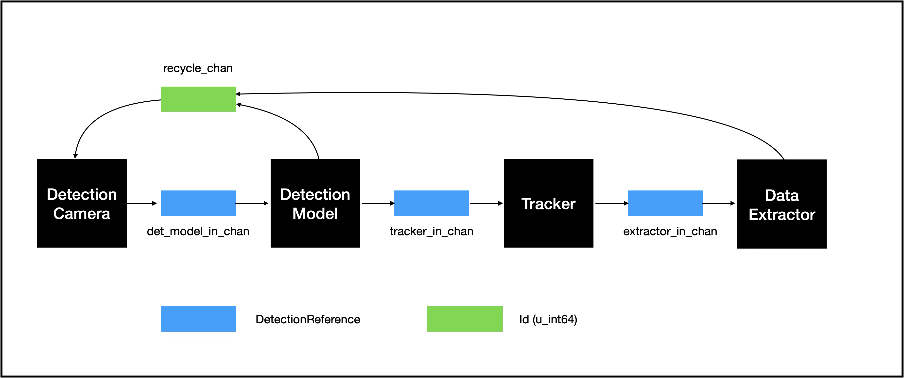
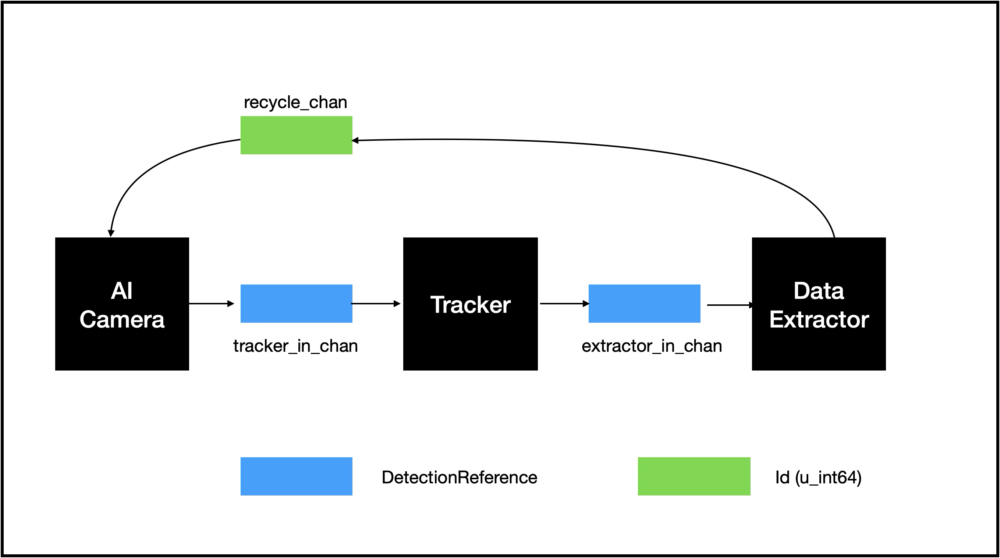
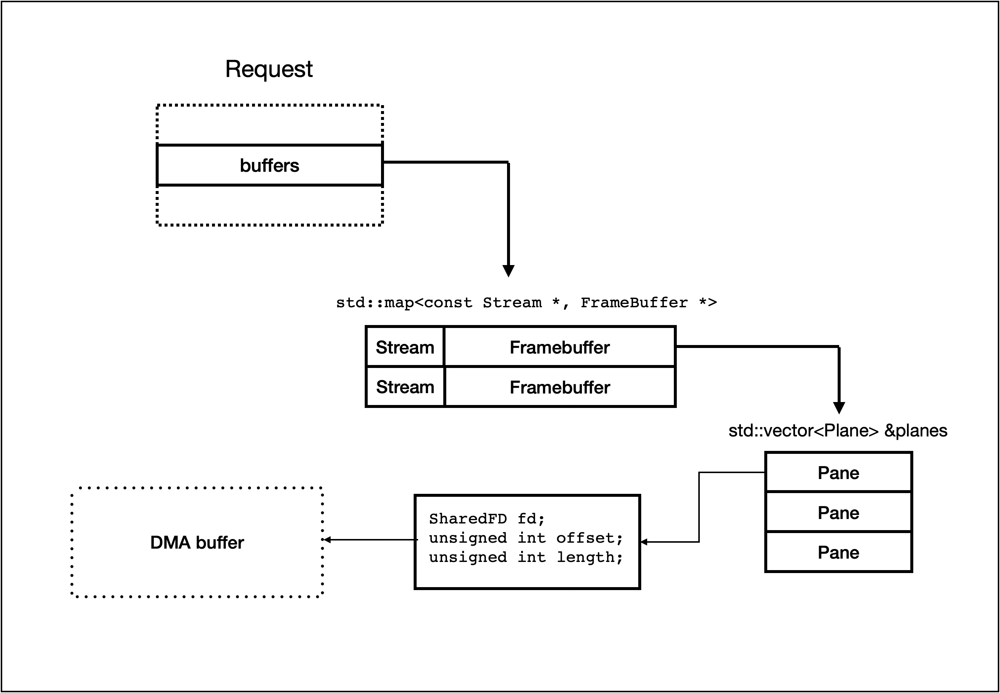
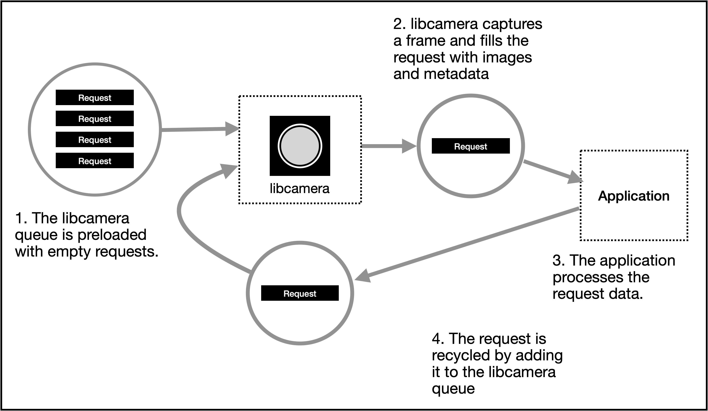

# Detection Flow

## Introduction

The Detection Flow is the core of a camera trap.  It is a processing flow that takes a video stream as its input and produces images of detected insects, annotated with metadata,  as its output.

The Detection Flow is modular and asynchronous. It is designed to extract the maximum available performance from the hardware by using multi-threading, system threads and green threads (co-routines).

It also maximises memory performance by storing and accessing image data using DMA. 

This has two advantages :

- A set of DMA buffers can be preallocated and reuses, avoiding the need for additional buffer allocation whilst the trap is running.
- The different processing steps can access the image data even from different threads. The data can be 'moved', simply by passing references to it. No copying is required.

There are 4 stages in the Detection Flow.

1. *Detection Camera* - a camera that observes the target and generates a high-resolution and a low-resolution video stream that are used for the detection. 
2. *Detection Model* - a Yolo11 model trained to detect insects. This takes each low-res frame and runs the detection model, recording bounding boxes around each insect found. These bounding boxes are upscaled  to the hi-res stream size, allowing hi-res images of the insects to be extracted from hi-res frames.
3. *Tracker* - the Tracker compares current detection data with previous data, to find multiple detections of the same insect. Each unique insect is assigned a track-id and this is added to the detection's  metadata.
4. *Metadata Generator*  - this actually extracts the deetections images from the hi-res frame and combines them with the correspondinfg metadata to provide a dataset that can be processed offline i.e. for insect identification.

## Datamodels and Dataflow

The 4 stages of the data flow are implemented as independent modules which pass information between themselves using message queues (or channels). The following diagram shows these components.

## Libcamera and its constraints

The entry point into the flow is a camera which provides the video streams to be processed. The standard library for managing cameras in a linux environment is [libcamera](https://libcamera.org).

> Libcamera. An open source camera stack and framework for Linux, Android, and ChromeOS

For more details [see here](https://libcamera.org/introduction.html)

libcamera is a complex library supporting a wide eange of camera types and applications. In addition to the standard libcamera, Raspberry maintains a fork of the standard library that contains functionality that supports Raspberry Pi specific cameras. The Raspberry Pi version is used in this project.

### Libcamera Streams, Framebuffers and Requests

Libcamera can capture image data from a camera. It is capable of capturing images in many different sizes and formats depending on the capabilities of the camera. libcamera. The definition of these parameters is called a **StreamConfiguration**, and the data produced by a StreamConfiguration is called a **Stream**.

In this project a stream is defined by:

- Image width
- Image height
- Colour encoding (always RGB888 - 24bit colour)

Libcamera can create multiple streams from a single capture (depending on the capabilities of the camera).

In this project there are 2 streams per capture:

- High-resolution stream - for creating hi-res images of the detected insects
- Low-resolution stream  - to feed the insect detection model.

The data captured is called a **Frame** and libcamera uses a preallocated segment of memory called a **FrameBuffer** to store the captured data. 

Liibcamera combines this information into an object called a **Request**. A Request serves two functions:

1. To identify the Streams that need to be captured.
2. To provide memory to store the captured images

Requests are allocated statically and are reused as the camera runs.

The following diagram shows a simplified view of a Request object.

A Request contains a field **buffers**  which contains a map of **Streams to Framebuffers**. This tells libcamera what to capture and where to write the data.

A Framebuffer is further divided into a set of **Panes**. The use of Panes will vary with the colour encoding. For example seperate Panes can be used to store R, G and B values. However the RGB888 encoding used in this project encodes everything into single 24bit values, so only one Pane is used.

The default implementation of a Pane (which is used i this project), is implemented using a DMA buffer. This is highly efficient since the data can be accessed easily without copying.

To create a video stream a small set of Request objects are created for rhe required Streams. These are queued by libcamera which captures a frame and fills the Request's data buffers.

Thes is passed to the application for further processing. The Request is passed back to libcamera and marked for reuse.

This processing loop will define the speed (in terms of frames per second) the project can achieve, and this will be largely controlled by the overll time it takes the application to process each frame. This can be optimised by parallelising the downstream application processing.
