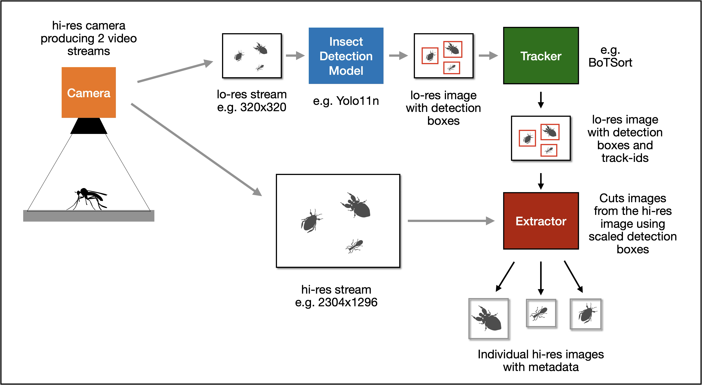

# Insect Trap Concept

## Introduction

The AI Insect Trap has one simple task:

> Using video from a camera pointing at a target area to produce a high-resolution image (with metadata), of each individual insect detected within the area.

Note the trap does not identify the insects, its job it simply to filter out insects from anything else in the video-stream, and to create individual images of the insects which can be passed to downstream (offline) processing which does the identification.

The trap is designed to be low-cost and run on commodity hardware, typically a Raspberry Pi. The trap software, which is written in C++,  is designged to use the cababilities of the hardware as effectvely and efficiently as possible. 

The following diagram shows the components of the trap concept.

## Camera

The trap uses a hi-res (at least 4k) video camera as its input. The main requirement is that it can provide two simultaneous video streams at different resolutions. Many low-cost cameras that are capable of doing this exist for the Raspberry Pi. 

The two streams are:

### High-resolution Stream

Typically 2304x1296 (or higher) RGB888 encoded. This is used to provide the final hi-res images of individual insects, which are cut from this image.

### Low-resolution Stream

Typically 320x320 or 640x640 RGB888 encoded.. Each fram of this stream is passed to  the insect detection model in its input tensor (see next section).

## Insect Detection Model

The Insect Detection Model is typically a Yolo11n detection model trained to detect insects. The Yolo11n model is designed to run on small devices and its maximum inpur tensor size is 640x640. Using smaller input tensors makes the model run faster at the expense of accuracy.

The output tensor of the model contains 0 or more 'detections' depending on how many insects were detected. Each detection contains:

- **A detection box.** A rectangle defining the position of the insect within the original lo-res frame.
- **A class-id**. Always insect
- **A score**. A confidence rating for the detection - maximum 1

## Tracker

The detection model produces output per video frame. This means that multiple detections of the same insect can appear in successive optput tensors.

The Tracker identifies these multiple detections and tags each one with the same track-id **which ultimately references a unique insect**.

This provides:

- More accurate counts of insect visits.
- A measurement of the duration of a visit.
- A track of the insect's movement during its visit.

## Extractor

The Extractor creates the individual hi-res images of insects by scaling the detection box rectangles to match the hi-res frame size, then cutting the corresponding images out of the hi-res frame and encoding them to PNG, adding the metadata in EXIF format and writing them to files.

